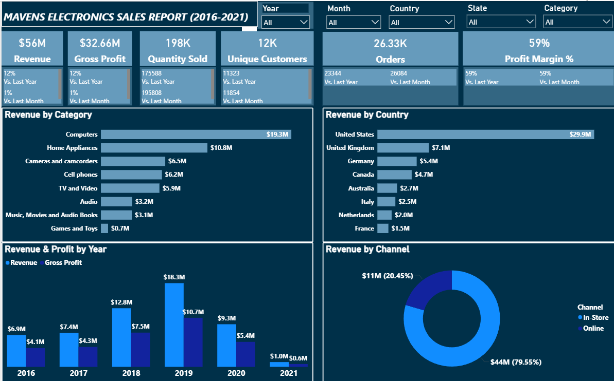
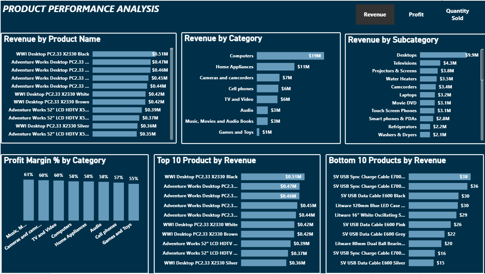
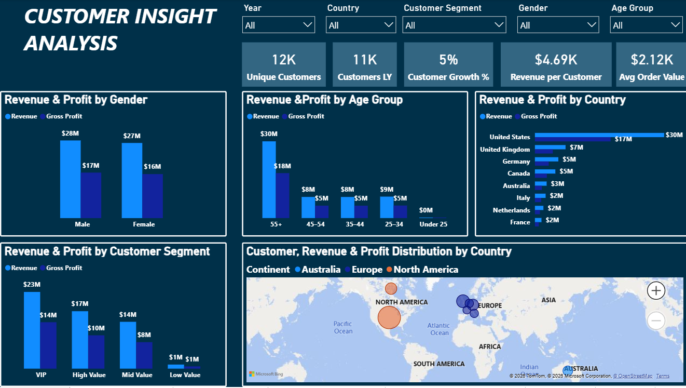

# 📊 Mavens Electronics Sales Performance Dashboard (Power BI)

## 🏢 Business Problem

Mavens Electronics needed better visibility into sales performance, profitability, customer behaviour, and product trends across multiple countries and sales channels.

The objective of this project was to build an interactive Power BI dashboard capable of helping stakeholders monitor business performance, identify growth opportunities, and support data-driven decision-making.

---

## 🎯 Project Goal

The goal of this project was to analyse business performance between 2016 and 2021 by uncovering insights related to:

- Revenue performance
- Gross profit analysis
- Product performance
- Customer behaviour
- Regional sales trends
- Revenue seasonality
- Year-over-year growth
- Profitability analysis

---

## 📁 Dataset Information

The dataset contains electronics sales transaction records between 2016 and 2021.

It includes:
- Sales transactions
- Customer information
- Product categories
- Regional performance data
- Profitability metrics

### Key Fields Included:
- Revenue
- Gross Profit
- Quantity Sold
- Orders
- Product Category
- Product Name
- Country
- State
- Customer Segment
- Gender
- Age Group
- Sales Channel
- Invoice Date

---

## 📊 Dashboard Pages

### 1. Executive Overview
Provides a high-level summary of:
- Revenue
- Gross Profit
- Quantity Sold
- Orders
- Profit Margin
- Country performance
- Revenue by category
- Revenue by sales channel

### 2. Performance Trend Analysis
Analyses:
- Profit trends over time
- Order volume trends
- Revenue seasonality
- Revenue year-over-year growth

### 3. Product Performance Analysis
Explores:
- Top-performing products
- Bottom-performing products
- Revenue by category
- Revenue by subcategory
- Profit margin analysis

### 4. Customer Insight Analysis
Provides insights into:
- Customer demographics
- Revenue by gender
- Revenue by customer segment
- Revenue by age group
- Geographic customer distribution

---

## 🧹 My Process

### 1. Data Cleaning
- Checked for missing values
- Standardized categories
- Verified data consistency
- Cleaned date formatting

### 2. Data Modelling & Analysis
- Created relationships between tables
- Built KPI measures
- Performed trend analysis
- Conducted profitability analysis

### 3. Dashboard Development
- Designed interactive dashboards
- Added slicers and filters
- Created KPI cards
- Developed multi-page reporting views

---

## 🛠️ Tools Used

- Power BI
- Power Query
- DAX
- Data Modelling
- Data Visualization
- Business Intelligence Reporting

---

## 🔍 Key Insights

- Revenue grew steadily between 2016 and 2019 before declining significantly afterward.
- The Computers category generated the highest revenue and profit.
- Revenue is heavily concentrated among top-performing products.
- VIP and high-value customers contribute the majority of total revenue.
- Older customer age groups generate higher revenue compared to younger demographics.
- The United States contributes the highest share of revenue among all countries.
- Revenue consistently peaks during the holiday season.

---

## 💡 Recommendations

- Focus investment on high-performing product categories such as Computers.
- Reevaluate underperforming products for possible replacement or improvement.
- Expand marketing efforts toward younger customer demographics.
- Strengthen customer retention strategies for VIP and high-value customers.
- Improve seasonal inventory planning during peak holiday periods.

---

## 🧠 Skills Demonstrated

- Power BI Dashboard Development
- Data Visualization
- DAX Calculations
- Business Intelligence Reporting
- Customer Analytics
- Product Performance Analysis
- Time-Series Analysis
- KPI Reporting
- Data Storytelling

---

## 📂 Repository Structure

- Dashboard Power BI File
- Dataset
- Dashboard Screenshots
- README Documentation

---

## 🖼️ Dashboard Preview

### Executive Overview

### Performance Trend Analysis

### Product Performance Analysis

### Customer Insight Analysis

---

## ✅ Final Conclusion

This project demonstrates how Power BI can be used to transform raw sales data into actionable business insights through interactive dashboards and analytical storytelling.

By combining data cleaning, modelling, visualization, and business analysis, the dashboard provides stakeholders with valuable insights into revenue trends, customer behaviour, product performance, and profitability to support strategic decision-making.
